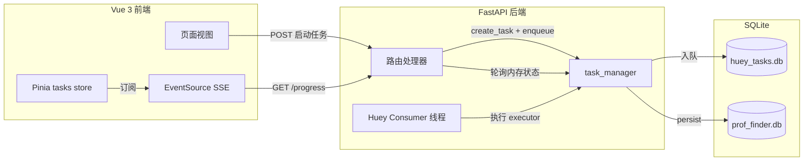
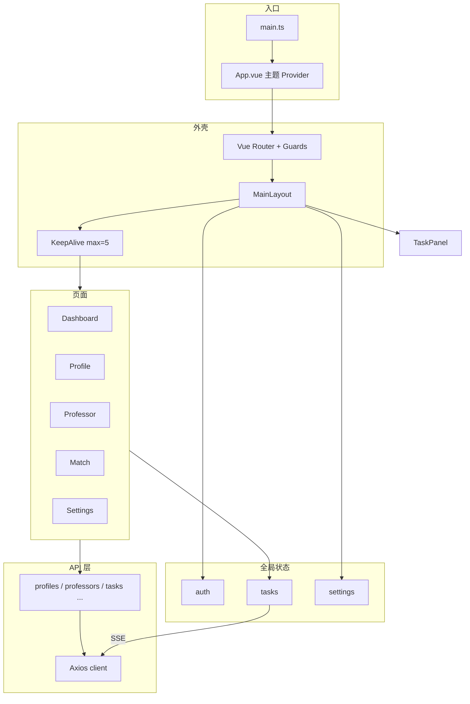
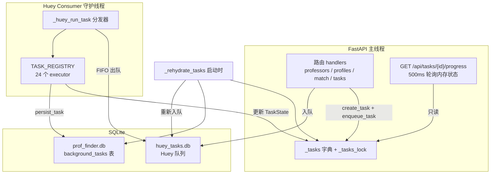
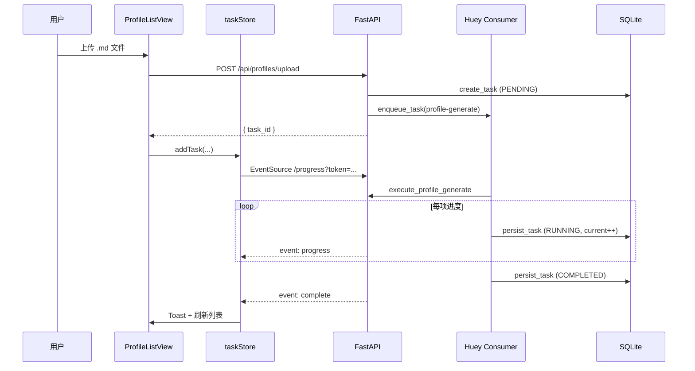

# Prof-Finder 前端与后台任务系统设计

[← 返回 README](../README.md) · [开发者文档](./development.zh.md)

本文档从**架构与设计决策**角度，说明 Prof-Finder Web 前端的组织方式，以及后端后台任务系统的运行机制。功能规格以 [`openspec/specs/`](../openspec/specs/) 为准；本文侧重「为什么这样设计」与「各层如何协作」。

---

## 总览

Prof-Finder 是一款本地优先的研究生导师匹配助手。用户通过 Web 界面完成「沉淀经历 → 建立画像 → 添加教授 → 智能匹配 → 生成套磁信」五步流程。其中大量操作（爬取、LLM 生成、语义匹配）耗时较长，因此系统采用**异步任务 + SSE 实时进度**的模式，前后端通过统一的任务协议解耦。



| 层级 | 核心技术 |
|------|----------|
| 前端 | Vue 3、TypeScript、Vite、Naive UI、Pinia、vue-i18n |
| 前端（AI 对话） | Tailwind CSS 4、shadcn-vue / Reka UI |
| 后台任务 | Huey（SqliteHuey）、SSE |
| API | FastAPI、JWT、Axios |

---

## 一、前端设计

### 1.1 设计目标

1. **流程导向**：界面结构与业务五步一致，降低首次使用成本。
2. **任务中心化**：所有耗时操作不阻塞页面，通过全局任务面板统一反馈进度。
3. **本地部署友好**：单用户/小团队场景，无需复杂的前端基础设施（无 SSR、无微前端）。
4. **双语优先**：默认中文，LLM 对话等接口传递当前 locale。
5. **渐进式 UI 现代化**：主体沿用 Naive UI 保证开发效率；仅在 AI 对话场景引入 shadcn-vue 组件栈。

### 1.2 技术栈与目录结构

```
frontend/src/
├── api/              # 按业务域划分的 Axios 封装
├── components/       # 共享组件（含 ui/、ai-elements/）
├── composables/      # 主题、错误处理、设置门控等
├── layouts/          # MainLayout 认证后外壳
├── locales/          # zh.json / en.json
├── router/           # 路由与导航守卫
├── stores/           # Pinia：auth、tasks、settings
├── types/            # 共享 TypeScript 类型
├── views/            # 路由级页面
├── App.vue           # Naive 主题 Provider
├── main.ts           # 应用入口
└── style.css         # 设计令牌（oklch）、暗色模式
```

**关键依赖**（见 `frontend/package.json`）：

| 类别 | 选型 | 用途 |
|------|------|------|
| 框架 | Vue 3 Composition API + `<script setup>` | 组件与逻辑组织 |
| 构建 | Vite 7 | 开发服务器、`/api` 代理到 `:8000` |
| 主 UI 库 | Naive UI | 表格、表单、布局、弹窗等 ~95% 界面 |
| 次 UI 库 | shadcn-vue + Reka UI + Tailwind 4 | AI 简历对话（`ProfileChatPanel`） |
| 路由 | Vue Router 4（history 模式） | SPA 导航 |
| 状态 | Pinia 3 | 仅跨页面/会话级状态 |
| HTTP | Axios | REST API，含 Token 自动刷新 |
| 国际化 | vue-i18n | 默认 `zh`，头部切换 EN/中 |

### 1.3 路由与导航守卫

路由定义于 `frontend/src/router/index.ts`，分为三类：

**公开路由**（无 `MainLayout`）：

| 路径 | 页面 | 说明 |
|------|------|------|
| `/setup` | SetupView | 便携版首次运行，选择数据目录 |
| `/login`、`/register` | 登录/注册 | 已登录则重定向首页 |
| `/change-password` | 强制改密 | `must_change_password` 时拦截 |

**认证后路由**（嵌套在 `MainLayout` 下）：

| 路径 | 页面 | 说明 |
|------|------|------|
| `/` | DashboardView | 首页：五步引导 + 统计 |
| `/pool`、`/pool/:id` | 信息池列表/工作台 | 脑暴、聚类、细化、文书 |
| `/profile`、`/profile/:id` | 画像列表/详情 | 上传、绑定信息池、编辑、AI 精炼 |
| `/professor`、`/professor/:id` | 教授列表/详情 | 导入、爬取、富化 |
| `/match` | MatchResultsView | 匹配 + 套磁信（`/letter` 重定向至此） |
| `/settings` | SettingsView | LLM 配置、密码、院校管理 |
| `/admin/users` | UsersView | 管理员用户管理 |

**导航守卫执行顺序**：

1. **Setup 门控**：便携版未配置 → 强制 `/setup`（`useSetupGate` + `api/setup.ts`）
2. **认证初始化**：从 `localStorage` 恢复 JWT
3. **未登录** → `/login?redirect=...`
4. **`must_change_password`** → `/change-password`
5. **非管理员访问 admin 路由** → `/`

**面包屑**：路由 `meta.breadcrumb` 声明静态标签；详情页通过 `provide('setBreadcrumbTitle')` 注入动态标题（`BreadcrumbNav.vue`）。

**性能**：`MainLayout` 对主内容区使用 `<KeepAlive :max="5">`，减少列表页往返时的重复请求。

### 1.4 状态管理策略

采用**薄全局状态 + 页面本地状态**模式：

| Store | 文件 | 职责 |
|-------|------|------|
| `auth` | `stores/auth.ts` | JWT、用户信息、`isAdmin`、`mustChangePassword`、登录/登出 |
| `tasks` | `stores/tasks.ts` | 后台任务 SSE 订阅、进度、取消/重试、完成通知、页面刷新恢复 |
| `settings` | `stores/settings.ts` | 用户设置缓存（LLM 配置等），去重 fetch |

列表筛选、表单草稿、分页参数等**留在各 View 的 `ref` 中**，不进入 Pinia。

**Composables**（非 Pinia 的横切逻辑）：

| Composable | 职责 |
|------------|------|
| `useTheme` | 暗色模式，持久化到 `localStorage`，同步 `document.documentElement.classList` |
| `useApiError` | 将 API 错误转为 Naive `useMessage` 提示 |
| `useSetupGate` | 便携版首次配置状态 |
| `useHelpDrawer` | 全局帮助抽屉 |
| `useDateLocale` | 与 i18n 一致的日期格式化 |
| `usePasswordChecks` | 注册/改密时的密码规则校验 |

### 1.5 API 集成

#### Axios 客户端

`frontend/src/api/client.ts`：

- `baseURL: '/api'`（开发时 Vite 代理到 `http://127.0.0.1:8000`）
- 请求拦截：附加 `Authorization: Bearer`；`FormData` 时移除 `Content-Type`
- 响应拦截：`401` 时去重刷新 Token（`/api/auth/refresh`），失败则登出并跳转 `/login`

#### 领域 API 模块

按业务拆分，每个模块导出纯函数对象，无 Repository 抽象层：

| 模块 | 文件 | 典型接口 |
|------|------|----------|
| `authApi` / `adminApi` | `api/auth.ts` | 登录、注册、用户管理 |
| `profilesApi` | `api/profiles.ts` | 画像 CRUD、上传、对话、精炼 |
| `professorsApi` | `api/professors.ts` | 教授 CRUD、爬取、DBLP/Scholar |
| `matchApi` | `api/match.ts` | 运行匹配、模型下载 |
| `lettersApi` | `api/letters.ts` | 套磁信生成 |
| `tasksApi` | `api/tasks.ts` | 任务列表、取消、重试、SSE URL |
| `settingsApi` | `api/settings.ts` | 用户设置 |
| `dashboardApi` | `api/dashboard.ts` | 首页聚合数据 |

类型集中在 `frontend/src/types/index.ts`。

#### 异步任务调用模式（核心）

长时间操作遵循统一协议：

```
1. View 调用 POST API
2. 响应 { task_id, total?, message }
3. taskStore.addTask(taskId, taskType, name, total, onComplete?)
4. Store 打开 EventSource → GET /api/tasks/{id}/progress?token=...
5. 接收事件：progress | complete | failed | cancelled
6. 完成时：Toast 通知 + 可选 onComplete 回调刷新列表
```

**SSE 鉴权**：`EventSource` 无法设置请求头，故将 JWT 放在 query `?token=` 中（后端 `get_current_user_sse` 同时支持 Header 与 query）。

**页面刷新恢复**：`MainLayout` 挂载时调用 `taskStore.restoreFromServer()`，从 `GET /api/tasks` 拉取 `pending`/`running`/`failed` 任务并重新订阅 SSE。

**登出清理**：`taskStore.reset()` 关闭所有 EventSource 连接。

**流式对话（例外）**：`profilesApi.chatStream` 使用 `fetch` + `ReadableStream` 解析 SSE，支持 `AbortController` 取消；不走 EventSource。

#### 任务完成后的列表刷新

`stores/tasks.ts` 维护 `PROFESSOR_LIST_REFRESH_TASK_TYPES` 与 `registerTaskTypeCompleteHandler`，教授相关任务完成后自动刷新教授列表，避免用户手动刷新。

### 1.6 视觉与交互设计

#### 设计系统

| 元素 | 实现 |
|------|------|
| 字体 | Geist（Google Fonts + Naive 覆盖） |
| 主色 | 蓝青色调 `oklch`，Naive 浅色主题约 `#2f6f8f` |
| 色空间 | `style.css` 中 oklch CSS 变量，`:root` + `.dark` 双主题 |
| 圆角 | Naive 10px；Tailwind/shadcn 0.625rem |
| 暗色模式 | `useTheme` + `App.vue` 中 Naive `darkTheme` 联动 |

#### 布局模式

- **认证后**：可折叠左侧栏（220px）+ 60px 顶栏 + 居中内容区（`max-width: 1440px`）
- **未认证**：全屏居中 `NCard`（约 400px 宽）
- **无障碍**：跳过导航链接、`main` 可聚焦

#### 通用交互模式

| 模式 | 使用场景 |
|------|----------|
| `NDataTable` + 行选择 | 画像/教授/匹配/用户列表 |
| `NModal` / `NDrawer` | 上传、导入、摘要预览 |
| `NPagination` | 教授列表、匹配结果（服务端分页） |
| `NPopconfirm` / `useDialog` | 删除确认 |
| `NTag` | 激活状态、任务状态 |
| 全局 `TaskPanel` + Toast | 后台任务进度 |

#### 双 UI 栈约定

- **Naive 页面**：`NCard` + `NSpace` + 少量 scoped CSS
- **AI 对话**：Tailwind 工具类 + `components/ai-elements/` + `cn()`（`lib/utils.ts`）
- **桥接**：`--primary`、`--muted` 等 CSS 变量在两套栈间共享

### 1.7 主要页面职责

| 页面 | 核心职责 | 触发的典型任务 |
|------|----------|----------------|
| DashboardView | 五步引导、统计、最近项、Top 匹配 | — |
| PoolListView / PoolWorkspaceView | 信息池管理；脑暴/聚类/细化/文书 | 文书草稿生成（同步 LLM 调用） |
| ProfileListView | 上传 `.md`/`.tex`、绑定信息池、手动创建、批量删除 | `profile-generate` |
| ProfileDetailView | 结构化编辑；AI 对话抽屉精炼画像 | `profile-refine` |
| ProfessorListView | 分页列表、Scholar/DBLP/院校导入 | `batch-crawl`、`university-crawl` 等 |
| ProfessorDetailView | 论文、DBLP 关联、富化、主页爬取 | `professor-enrichment`、`paper-summary` 等 |
| MatchResultsView | 运行匹配、模型下载、套磁信 | `match`、`download-model`、`single-letter` |
| SettingsView | LLM 配置、爬取延迟、自动富化开关 | — |

### 1.8 前端关键组件

| 组件 | 职责 |
|------|------|
| `MainLayout.vue` | 侧栏、顶栏（主题/语言/帮助/任务/用户）、API Key 横幅 |
| `TaskPanel.vue` | 顶栏任务弹出层：运行中/失败/已完成、进度条、取消/重试 |
| `TaskNotificationHost.vue` | 任务终态 Toast |
| `ProfileChatPanel.vue` | AI 简历对话（shadcn ai-elements） |
| `ProfessorSummaryDrawer.vue` | 列表页快速预览教授摘要 |
| `HelpDrawer.vue` | 应用内帮助文档 |
| `BreadcrumbNav.vue` | 动态面包屑 |

### 1.9 前端架构图



---

## 二、后台任务系统设计

### 2.1 设计目标与演进

**目标**：

1. **单机本地部署**：无需 Redis、独立 Worker 进程或消息中间件。
2. **HTTP 快速返回**：路由只做校验与入队，耗时逻辑在后台线程执行。
3. **可观测**：SSE 推送进度；刷新页面后可恢复订阅。
4. **可恢复**：进程重启后，未完成任务重新入队（不恢复执行到一半的中间状态）。
5. **与 FastAPI 事件循环解耦**：阻塞 I/O（爬虫、LLM）不占用 asyncio 主线程。

**演进**：早期使用 `asyncio.create_task()` + 内存字典，SSE 断开可能导致生成器被取消。2026 年迁移至 **Huey + SqliteHuey**（见 `openspec/changes/archive/2026-06-04-migrate-to-huey-task-queue/`），执行与 SSE 推送彻底分离。

### 2.2 整体架构



**关键决策**：

| 决策 | 理由 |
|------|------|
| SqliteHuey 而非 Redis | 与「本地 SQLite 应用」定位一致，零外部依赖 |
| Consumer 为 daemon 线程 | 与 uvicorn 同进程，便携包一键启动 |
| 队列库与业务库分离 | `huey_tasks.db` 与 `prof_finder.db` 职责清晰 |
| 单一 `@huey.task()` + 扁平注册表 | 避免 Huey 实例与 executor 之间的循环导入 |
| 同步 executor | 在 worker 线程中运行，无需 asyncio 桥接 |
| SSE 纯轮询 | SSE 端点不执行业务逻辑，断开连接不影响任务 |
| 无定时调度器 | 所有任务由 API 事件触发，无 cron |
| 无自动重试 | 失败任务由用户通过 API 手动重试 |

### 2.3 核心模块

| 模块 | 路径 | 职责 |
|------|------|------|
| 任务队列 | `backend/prof_finder/api/task_queue.py` | Huey 实例、`@register_task` 注册、`enqueue_task`、Consumer 启停 |
| 任务管理 | `backend/prof_finder/api/task_manager.py` | `TaskState`、create/get/persist、cleanup、24 个 executor |
| 任务 API | `backend/prof_finder/api/routes/tasks.py` | 批量任务入口、SSE、列表、取消、重试 |
| 持久化模型 | `backend/prof_finder/models/background_task.py` | `background_tasks` 表 |
| 应用生命周期 | `backend/prof_finder/api/main.py` | `_rehydrate_tasks`、`start_consumer` / `stop_consumer` |
| 配置 | `backend/prof_finder/config.py` | `HUEY_DB_PATH`、`HUEY_CONSUMER_WORKERS`（默认 2） |

### 2.4 任务生命周期

#### 状态机

```
PENDING → RUNNING → COMPLETED
                  → FAILED
                  → CANCELLED
```

#### TaskState 字段（内存 + DB 镜像）

| 字段 | 说明 |
|------|------|
| `task_id` | UUID4 |
| `task_type` | 注册表键名 |
| `task_name` | UI 显示名称 |
| `user_id` | 任务所属用户 |
| `total` / `current` | 进度 |
| `success_count` / `failed_count` | 批量任务统计 |
| `message` / `error_message` | 用户可见状态 |
| `results` | 每项结果的 JSON 列表 |
| `cancel_requested` | 协作式取消标志 |
| `huey_result_id` | 用于 `huey.revoke_by_id()`（仅内存） |
| `enqueue_args` / `enqueue_kwargs` | 重启恢复与手动重试参数（持久化） |

#### 标准 Executor 模式

所有 executor 为**同步函数**，通过 `@register_task("<type>")` 注册：

```python
@register_task("example-task")
def execute_example(task_id: str, ...):
    task = get_task(task_id)
    if not task:
        return
    task.status = TaskStatus.RUNNING
    persist_task(task)

    for item in items:
        if task.cancel_requested:
            task.status = TaskStatus.CANCELLED
            persist_task(task)
            return
        # 处理单项，更新 current / message / results
        persist_task(task)

    task.status = TaskStatus.COMPLETED
    persist_task(task)
```

**批量任务**：单项失败记入 `results` 并递增 `failed_count`，循环继续（部分失败可接受）。

**取消**：executor 在循环中检查 `cancel_requested`；富化逻辑可抛出 `TaskCancelled`。队列中尚未开始的任务通过 `huey.revoke_by_id()` 撤销。

### 2.5 任务触发流程

```
HTTP POST（业务路由或 /api/tasks/*）
  → 同步校验前置条件（如 API Key、模型是否就绪）
  → cleanup_old_tasks()          # 清理 5 分钟前的终态内存条目
  → create_task()                # 写入内存 + background_tasks，status=PENDING
  → enqueue_task()               # 入 Huey 队列，记录 huey_result_id 与 enqueue 参数
  → 返回 TaskStartResponse { task_id, message, total? }
```

Huey Consumer 线程出队 → `_huey_run_task(task_type, task_id, args, kwargs)` → 查 `TASK_REGISTRY` 调用对应 executor。

### 2.6 任务类型一览

共 **24** 种注册类型（`task_manager.py`）：

| task_type | 典型触发 API | 说明 |
|-----------|--------------|------|
| `profile-generate` | `POST /api/profiles/upload` | 上传简历后 LLM 生成画像 |
| `profile-refine` | `POST /api/profiles/{id}/refine` | 对话精炼画像 |
| `profile-parse` | （无当前路由） | 已被 `profile-generate` 取代 |
| `single-crawl` | `POST /api/professors/scholar` 等 | 单个 Scholar 爬取 |
| `batch-crawl` | `POST /api/tasks/batch-crawl` | 批量 Scholar |
| `single-dblp-crawl` | `POST /api/professors/dblp` 等 | 单个 DBLP |
| `batch-dblp-crawl` | `POST /api/tasks/batch-dblp-crawl` | 批量 DBLP |
| `university-crawl` | `POST /api/professors/crawl-university` | 指定院校名单 |
| `generic-university-crawl` | `POST /api/professors/crawl-configured` | 配置化院校爬虫 |
| `batch-dblp-match` | `match-dblp`、`match-external` | DBLP 匹配 |
| `professor-enrichment` | 手动创建、爬取后链式 | 单教授数据富化 |
| `batch-professor-enrichment` | 批量爬取后链式 | 批量富化 |
| `paper-summary` | `POST .../summarize-sources` | 论文摘要 |
| `professor-profile` | `POST .../generate-profile` | 教授科研画像 |
| `batch-professor-profiles` | `POST .../batch-generate-profiles` | 批量画像 |
| `professor-homepage-crawl` | `POST .../crawl-homepage` | 主页爬取 |
| `fill-publications` | `POST .../fill-publications` | 补全论文摘要 |
| `batch-refresh` | `POST .../batch-refresh` | 批量刷新 Scholar |
| `batch-refresh-dblp` | `POST .../batch-refresh-dblp` | 批量刷新 DBLP |
| `batch-refresh-external` | `POST .../batch-refresh-external` | 批量刷新外部源 |
| `match` | `POST /api/match/run` | 语义匹配 |
| `download-model` | `POST /api/match/download-model` | 下载嵌入模型 |
| `single-letter` | `POST /api/letters/{id}/generate` | 单封套磁信 |
| `batch-letters` | `POST /api/tasks/batch-letters` | 批量套磁信 |

### 2.7 任务链（Pipeline）

父任务完成后，根据用户设置（`UserSettings` 中的自动富化开关）**入队子任务**：

```
batch-crawl / single-crawl / single-dblp-crawl
  └─► professor-enrichment（若开启自动富化）

university-crawl / generic-university-crawl
  ├─► batch-professor-enrichment（若开启）
  └─► batch-dblp-match（generic crawl 且已配置）

batch-refresh
  └─► batch-professor-enrichment（针对已刷新教授）
```

链式入队通过 `create_task` + `enqueue_task` 完成，非 Huey 内置 pipeline。

### 2.8 监控：SSE 与任务列表

#### SSE 进度流

`GET /api/tasks/{task_id}/progress`：

- 每 **500ms** 读取内存中 `TaskState`，有变化则推送
- 事件类型：`progress`、`complete`、`failed`、`cancelled`
- **不执行业务逻辑**，仅反映 executor 写入的状态

示例事件：

```
event: progress
data: {"current": 5, "total": 20, "status": "running", "message": "正在处理..."}

event: complete
data: {"status": "completed", "success_count": 18, "failed_count": 2, "results": [...]}
```

#### 任务列表

`GET /api/tasks`：返回当前用户的 `PENDING`、`RUNNING`、`FAILED` 任务，供前端 `restoreFromServer()` 使用。

### 2.9 取消与重试

#### 取消

`POST /api/tasks/{task_id}/cancel`：

1. 设置 `cancel_requested = True`
2. 若有 `huey_result_id` → `huey.revoke_by_id()`（撤销队列中未开始的）
3. `PENDING` → 立即 `CANCELLED`；`RUNNING` → executor 在下一检查点停止
4. `persist_task(task)`

#### 重试

**无 Huey 自动重试**。手动重试：

`POST /api/tasks/{task_id}/retry`（仅 `FAILED`）：

- 创建**新** `task_id`，复用 `task_type`、`task_name`、`total`
- 使用原任务的 `enqueue_args` / `enqueue_kwargs` 重新入队
- 必要时刷新 kwargs 中的 `user_id`

### 2.10 持久化与内存清理

| 存储 | 内容 | 用途 |
|------|------|------|
| 内存 `_tasks` | 完整 `TaskState` | SSE 高频读取 |
| `background_tasks` 表 | 任务快照 | 重启恢复、审计 |
| `huey_tasks.db` | Huey 队列 | FIFO 调度 |

- `persist_task()`：executor 更新进度时写入 DB
- `cleanup_old_tasks()`：终态任务在内存中保留 **5 分钟**后清除（每分钟最多执行一次）；DB 行保留
- `huey_result_id` **不持久化**；重启后靠 `enqueue_args`/`enqueue_kwargs` 重新入队

### 2.11 启动时任务恢复（Rehydration）

`main.py` 生命周期中 `_rehydrate_tasks()`：

1. 从 DB 加载 `status IN ('pending', 'running')` 的记录
2. 重建内存 `TaskState`
3. 若 `cancel_requested` → 标记 `CANCELLED`
4. 若有 `enqueue_args` 或 `enqueue_kwargs` → 重置为 `PENDING`、`current=0`，重新 `enqueue_task()`
5. 若无 enqueue 参数（迁移前旧任务）→ 标记 `FAILED` 并附迁移说明
6. 调用 `start_consumer()` 启动 Consumer

**注意**：不恢复执行到一半的中间进度；重启等于用相同参数重新跑一遍。

### 2.12 任务管理 API

路由前缀 `/api/tasks`（`routes/tasks.py`）：

| 方法 | 路径 | 说明 |
|------|------|------|
| `POST` | `/batch-crawl` | 批量 Scholar 爬取 |
| `POST` | `/batch-dblp-crawl` | 批量 DBLP |
| `POST` | `/batch-letters` | 批量套磁信 |
| `GET` | `/{task_id}/progress` | SSE 进度流 |
| `POST` | `/{task_id}/cancel` | 取消 |
| `GET` | `` | 任务列表 |
| `POST` | `/{task_id}/retry` | 重试失败任务 |

其他业务路由（`professors`、`profiles`、`match`、`letters`）在操作耗时逻辑时同样调用 `create_task` + `enqueue_task`，返回 `TaskStartResponse`。

### 2.13 CLI 例外

`backend/prof_finder/cli/professor.py` 中 `execute_professor_enrichment()` 可被 **直接同步调用**（阻塞 CLI），仍通过 `create_task` 记录状态，但绕过 Huey 队列。

---

## 三、前后端协作：端到端时序

以「上传简历生成画像」为例：



**设计要点**：

1. 用户无需等待 HTTP 长连接；POST 立即返回 `task_id`。
2. 前端可关闭页面再打开，`restoreFromServer` 重新订阅。
3. 后端 executor 与 SSE 连接生命周期无关。
4. 多个任务可并行（默认 2 worker），但无 per-user 队列隔离。

---

## 四、配置与环境变量

| 变量 | 默认值 | 说明 |
|------|--------|------|
| `HUEY_DB_PATH` | `./data/huey_tasks.db` | Huey 队列库路径 |
| `HUEY_CONSUMER_WORKERS` | `2` | Consumer 工作线程数 |
| `DATABASE_PATH` | `./data/prof_finder.db` | 业务库（含 `background_tasks`） |

便携版运行时路径由 `packaging` 模块解析到用户选择的数据目录。

---

## 五、相关规格与测试

| 文档 | 路径 |
|------|------|
| 异步任务规格 | `openspec/specs/async-tasks/spec.md` |
| 任务面板规格 | `openspec/specs/task-panel/spec.md` |
| Web 前端规格 | `openspec/specs/web-frontend/spec.md` |
| 数据模型（background_tasks） | `openspec/specs/data-model/spec.md` |
| Huey 迁移设计 | `openspec/changes/archive/2026-06-04-migrate-to-huey-task-queue/design.md` |

**测试**：`backend/tests/test_task_queue.py` 覆盖注册、入队、取消、链式任务、Consumer 生命周期与 rehydration。

---

## 六、设计权衡小结

| 主题 | 选择 | 代价 |
|------|------|------|
| 前端状态 | Pinia 仅 auth/tasks/settings | 页面间共享复杂状态需显式设计 |
| UI 库 | Naive + shadcn 双栈 | 两套样式约定，AI 区独立维护 |
| 任务队列 | Huey SqliteHuey | 吞吐量受单机与 2 worker 限制 |
| 任务状态 | 内存 + DB 双写 | 重启丢失进行中细粒度进度 |
| 取消 | 协作式 | 无法强制终止阻塞中的单次 LLM 调用 |
| 重试 | 手动 API | 无指数退避自动恢复 |
| SSE | 500ms 轮询 | 非推送级实时，但实现简单可靠 |

上述权衡与 Prof-Finder「本地单用户、一键部署」的产品定位一致。若未来需要多机部署或更高并发，需重新评估队列后端（如 Redis）与独立 Worker 进程。
