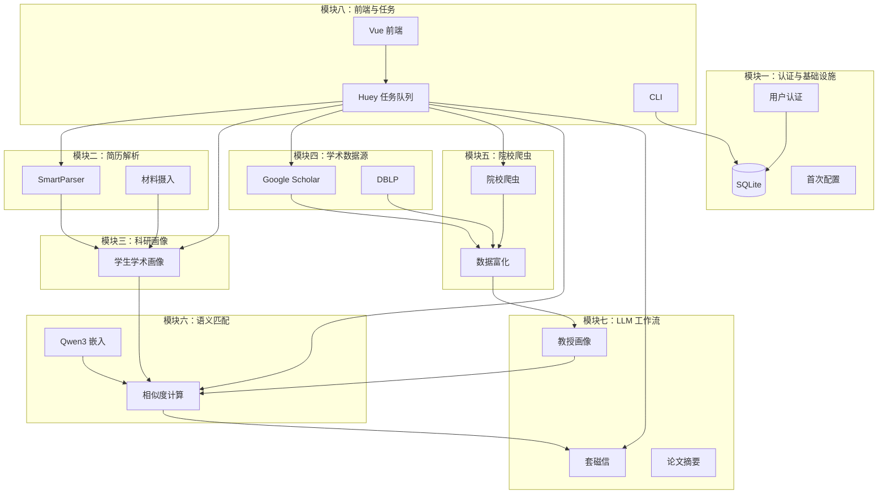

# Prof-Finder 项目八模块汇报稿

> 本文档按**项目实际代码结构**划分八个功能模块，供八位成员分别汇报。  
> 划分依据为后端模块边界、前端页面流程与核心业务链路，不参考历史分工文档。

---

## 项目总览

**Prof-Finder** 是一款在本机运行的研究生导师智能匹配助手，帮助大学生寻找未来 PhD/MPhil 导师。核心用户流程与 Web 侧边栏四步一致：

```
上传简历 → 添加教授 → 智能匹配 → 生成套磁信
```

### 技术栈一览

| 层级 | 技术 |
|------|------|
| 前端 | Vue 3、TypeScript、Vite、Naive UI、Pinia、vue-i18n、Tailwind CSS |
| 后端 API | FastAPI、SQLAlchemy、Pydantic、JWT 认证 |
| 后台任务 | Huey（SqliteHuey）、SSE 进度推送 |
| AI / 嵌入 | Qwen3-Embedding-0.6B、OpenAI 兼容 API / Anthropic SDK |
| 数据采集 | scholarly（Google Scholar）、DBLP API、Crawl4AI（院校网页） |
| 存储 | 本地 SQLite，每用户数据隔离 |
| 分发 | PyInstaller 便携包（Windows / macOS） |

### 仓库结构

```
prof-finder/
├── backend/prof_finder/     # API、CLI、爬虫、匹配、LLM、任务队列
│   ├── api/                 # FastAPI 路由与任务管理
│   ├── parser/              # 简历解析
│   ├── crawler/             # 教授信息采集
│   ├── matcher/             # 语义匹配
│   ├── llm/                 # LLM 内容生成
│   ├── ai_workflows/        # 可测试的纯 AI 工作流
│   ├── models/              # SQLAlchemy 数据模型
│   ├── db/                  # 数据库连接
│   ├── packaging/           # 便携版路径与卸载
│   └── cli/                 # 命令行工具
├── backend/tests/           # pytest 测试（32 个测试文件）
├── frontend/src/            # Vue 3 前端
├── scripts/                 # 便携包构建、第三方声明生成
└── docs/                    # 用户与开发文档
```

### 八模块划分总表

| 模块 | 名称 | 核心职责 |
|:----:|------|----------|
| 一 | 用户认证与平台基础设施 | 登录注册、多用户隔离、首次配置、便携版部署 |
| 二 | 学生简历解析与材料摄入 | Markdown/LaTeX 解析、LLM 语义解析、原始材料管理 |
| 三 | 学生科研画像生成 | 多材料融合、学术画像 LLM 生成、画像对话精炼 |
| 四 | 教授信息采集（学术数据源） | Google Scholar、DBLP 检索与导入 |
| 五 | 教授信息采集（院校爬虫与富化） | 院校名单爬取、Crawl4AI、Scholar 匹配与数据增强 |
| 六 | 语义匹配引擎 | Qwen3 嵌入向量、师生相似度计算、匹配结果管理 |
| 七 | LLM 工作流与套磁信生成 | 论文摘要、教授科研画像、个性化联络信 |
| 八 | Web 前端与后台任务系统 | Vue 界面、Huey 任务队列、SSE 进度、CLI |

---

## 模块一：用户认证与平台基础设施

### 1.1 模块定位

本模块是 Prof-Finder 的「地基」：负责用户身份管理、本地数据隔离、便携版首次引导，以及全局配置与安全策略。所有业务数据（简历、教授、匹配结果）均按 `user_id` 隔离存储。

### 1.2 核心功能

- **用户注册与登录**：JWT Access Token + Refresh Token，支持 Web 端开放注册
- **管理员账户**：默认 `root` / `root123`，首次登录强制改密；管理员可管理用户列表
- **每用户独立设置**：LLM API Key、Base URL、模型名、爬取延迟、自动富化开关、输出语言偏好
- **便携版首次配置**：选择数据目录、嵌入模型目录，写入 `install.json`
- **健康检查与 CORS**：开发模式下前端 `5173` 代理到后端 `8000`

### 1.3 技术实现

| 组件 | 路径 | 说明 |
|------|------|------|
| 认证路由 | `backend/prof_finder/api/routes/auth.py` | 注册、登录、刷新 Token、改密 |
| JWT 工具 | `backend/prof_finder/api/auth.py` | 密码哈希（bcrypt）、Token 签发与校验 |
| 依赖注入 | `backend/prof_finder/api/deps.py` | `get_current_user`、`get_admin_user` |
| 首次配置 | `backend/prof_finder/api/routes/setup.py` | 便携版存储路径选择与校验 |
| 设置 API | `backend/prof_finder/api/routes/settings.py` | 读写用户 LLM 与爬虫配置 |
| 数据模型 | `backend/prof_finder/models/schema.py` | `User`、`UserSettings` |
| 数据库 | `backend/prof_finder/db/database.py` | SQLite 连接与会话管理 |
| 便携版路径 | `backend/prof_finder/packaging/paths.py` | 数据目录安全校验 |
| 启动器 | `backend/prof_finder/launcher.py` | 便携版进程入口 |
| 全局配置 | `backend/prof_finder/config.py` | 环境变量与 `.env` 读取 |

### 1.4 前端对应

| 页面/组件 | 路径 |
|-----------|------|
| 登录 | `frontend/src/views/auth/LoginView.vue` |
| 注册 | `frontend/src/views/auth/RegisterView.vue` |
| 强制改密 | `frontend/src/views/auth/ChangePasswordView.vue` |
| 首次配置 | `frontend/src/views/setup/SetupView.vue` |
| 设置页 | `frontend/src/views/settings/SettingsView.vue` |
| 用户管理（管理员） | `frontend/src/views/admin/UsersView.vue` |
| 认证状态 | `frontend/src/stores/auth.ts` |
| 路由守卫 | `frontend/src/router/index.ts`（认证、改密、管理员、Setup 门禁） |

### 1.5 数据模型要点

```python
# User：username, password_hash, is_admin, must_change_password
# UserSettings：llm_provider, llm_api_key, llm_base_url, llm_model,
#                request_delay, auto_enrich_*, profile_language
```

### 1.6 测试覆盖

- `backend/tests/test_api_auth.py`
- `backend/tests/test_api_settings.py`
- `backend/tests/test_install_config.py`

### 1.7 汇报要点

1. 说明多用户本地隔离的设计理由（隐私、不上传云端）
2. 演示注册 → 登录 → 强制改密 → 配置 LLM API 的完整流程
3. 介绍便携版 `install.json` 与数据目录校验逻辑
4. 强调 API Key 仅存本地 SQLite、接口返回脱敏值

---

## 模块二：学生简历解析与材料摄入

### 2.1 模块定位

负责将用户上传的简历文件（Markdown、LaTeX）解析为结构化字段，并管理原始材料（Source Input）。这是「学生侧」数据链路的入口。

### 2.2 核心功能

- **多格式简历解析**：`.md`、`.markdown`、`.txt`、`.tex`、`.latex`
- **智能解析策略**：优先 LLM 语义理解，失败时回退正则解析器（`SmartParser`）
- **结构化输出**：姓名、教育经历、科研经历、项目、技能等 JSON 字段
- **原始材料管理**：ArXiv 等外部来源的录入与状态跟踪（`SourceInput` 模型）
- **CLI 支持**：`prof-finder profile upload resume.md`

### 2.3 技术实现

| 组件 | 路径 | 说明 |
|------|------|------|
| 智能解析器 | `backend/prof_finder/parser/smart_parser.py` | LLM 优先 + 正则回退 |
| Markdown 解析 | `backend/prof_finder/parser/markdown_parser.py` | 正则提取 |
| LaTeX 解析 | `backend/prof_finder/parser/latex_parser.py` | LaTeX 简历解析 |
| LLM 解析 | `backend/prof_finder/parser/llm_parser.py` | 调用 LLM 做语义结构化 |
| 解析基类 | `backend/prof_finder/parser/base.py` | `ParsedResume` 数据类 |
| 材料 API | `backend/prof_finder/api/routes/source_inputs.py` | 外部材料 CRUD |
| 材料服务 | `backend/prof_finder/api/source_input_service.py` | 材料与教授关联逻辑 |
| 画像 API（解析部分） | `backend/prof_finder/api/routes/profiles.py` | 文件上传与 `profile-parse` 任务 |
| CLI | `backend/prof_finder/cli/profile.py` | 命令行上传简历 |

### 2.4 解析流程

```
上传文件
  → 判断格式（md / tex）
  → SmartParser
      ├─ prefer_llm=True → LLMParser（需配置 LLM API）
      └─ 失败或 prefer_llm=False → MarkdownParser / LaTeXParser
  → ParsedResume（结构化字段 + raw_content）
  → 写入 UserProfile 表
```

### 2.5 后台任务

- `profile-parse`：异步解析上传的简历文件（`task_manager.py`）

### 2.6 前端对应

| 页面/组件 | 路径 |
|-----------|------|
| 画像列表 | `frontend/src/views/profile/ProfileListView.vue` |
| 画像详情（上传/解析） | `frontend/src/views/profile/ProfileDetailView.vue` |
| API 客户端 | `frontend/src/api/profiles.ts`、`frontend/src/api/source-inputs.ts` |

### 2.7 测试覆盖

- `backend/tests/test_parser.py`
- `backend/tests/test_llm_parser.py`
- `backend/tests/test_api_profiles.py`
- `backend/tests/test_api_source_inputs.py`
- `backend/tests/test_source_input_service.py`

### 2.8 汇报要点

1. 对比 LLM 解析与正则解析的准确率与离线可用性
2. 演示上传 `.md` 与 `.tex` 简历后的字段提取效果
3. 说明 `SmartParser` 的回退机制设计
4. 介绍 `SourceInput` 如何为后续论文摘要提供原材料

---

## 模块三：学生科研画像生成

### 3.1 模块定位

在简历解析基础上，将多份材料（简历、手动输入、补充说明）融合为统一的**学术科研画像**（`academic_profile`），供后续语义匹配使用。支持增量更新与对话式精炼。

### 3.2 核心功能

- **多材料融合生成**：`StudentProfileGenerator` 调用 LLM 综合多源信息
- **学术画像字段**：`academic_profile`（长文本）、`profile_analysis`（结构化分析）、`evidence_notes`、`conflict_notes`
- **增量更新**：基于已有画像与新材料做差异合并（`profile_merge.py`）
- **对话精炼**：用户通过聊天方式修正画像（`profile-refine` 任务、SSE 流式响应）
- **激活画像**：匹配时仅使用 `is_active=True` 的画像
- **多画像管理**：同一用户可维护多份申请方向画像

### 3.3 技术实现

| 组件 | 路径 | 说明 |
|------|------|------|
| 画像生成器 | `backend/prof_finder/llm/student_profile_generator.py` | LLM 生成学术画像 |
| AI 工作流 | `backend/prof_finder/ai_workflows/workflows.py` | `generate_student_profile()` 纯函数 |
| 画像合并 | `backend/prof_finder/utils/profile_merge.py` | 增量合并逻辑 |
| 活跃画像查询 | `backend/prof_finder/utils/query_cache.py` | `get_active_profile()` |
| 画像 API | `backend/prof_finder/api/routes/profiles.py` | CRUD、生成、精炼、激活 |
| Prompt 模板 | `backend/prof_finder/prompts/` | 学生画像相关提示词 |
| 数据模型 | `UserProfile` | `academic_profile`, `profile_materials`, `manual_inputs` 等 |

### 3.4 后台任务

| 任务类型 | 说明 |
|----------|------|
| `profile-generate` | 从材料生成/更新学术画像 |
| `profile-refine` | 对话式精炼画像 |

### 3.5 前端对应

- 画像详情页中的「生成画像」「对话精炼」交互：`ProfileDetailView.vue`
- 仪表盘进度条第一步「上传简历」完成判定：`DashboardView.vue`

### 3.6 测试覆盖

- `backend/tests/test_student_profile_generator.py`
- `backend/tests/test_profile_merge.py`
- `backend/tests/test_api_profiles.py`

### 3.7 汇报要点

1. 解释「简历解析」与「科研画像」的区别：前者是结构化字段，后者是面向匹配的语义文本
2. 展示 `academic_profile` 示例及其在匹配中的用途
3. 说明 `evidence_notes` / `conflict_notes` 如何帮助用户审阅 AI 输出
4. 演示对话精炼功能的用户体验

---

## 模块四：教授信息采集（学术数据源）

### 4.1 模块定位

从公开学术数据库获取教授信息，主要包括 **Google Scholar** 和 **DBLP** 两条链路。支持搜索、导入、刷新与候选确认。

### 4.2 核心功能

#### Google Scholar

- 通过 Scholar ID 或 URL 导入教授基本信息
- 获取 h-index、总引用、研究方向、论文列表（默认前 20 篇）
- 教授搜索：`prof-finder professor search "Andrew Ng"`
- 可配置代理（`scholarly_proxy`）应对访问限制

#### DBLP

- 通过 DBLP PID 或 URL 导入教授
- DBLP 姓名搜索与候选列表确认（消歧）
- 论文列表与元数据获取
- DBLP 与 Scholar 数据可并存于同一 `Professor` 记录

### 4.3 技术实现

| 组件 | 路径 | 说明 |
|------|------|------|
| Scholar 爬虫 | `backend/prof_finder/crawler/scholar.py` | `ScholarCrawler`，基于 scholarly 库 |
| DBLP 客户端 | `backend/prof_finder/crawler/dblp.py` | `DblpClient`，DBLP API 封装 |
| DBLP 匹配 | `backend/prof_finder/crawler/dblp_matcher.py` | 姓名搜索与候选评分 |
| Scholar 匹配 | `backend/prof_finder/crawler/scholar_matcher.py` | 院校爬虫教授的 Scholar 自动匹配 |
| 匹配上下文 | `backend/prof_finder/utils/scholar_match_context.py` | 匹配参数解析 |
| 教授 API | `backend/prof_finder/api/routes/professors.py` | Scholar/DBLP 添加、搜索、刷新 |
| 论文合并 | `backend/prof_finder/utils/publication_merge.py` | 多来源论文去重合并 |
| 教授去重 | `backend/prof_finder/utils/professor_dedup.py` | 同用户下教授去重 |

### 4.4 后台任务（与本模块相关）

| 任务类型 | 说明 |
|----------|------|
| `single-crawl` | 单个 Scholar 教授爬取 |
| `batch-crawl` | 批量 Scholar 爬取 |
| `single-dblp-crawl` | 单个 DBLP 导入 |
| `batch-dblp-crawl` | 批量 DBLP 导入 |
| `batch-dblp-match` | 批量 DBLP 姓名匹配 |
| `batch-refresh` / `batch-refresh-dblp` / `batch-refresh-external` | 批量刷新教授数据 |
| `fill-publications` | 补全论文详情 |

### 4.5 数据模型要点

```python
# Professor 关键字段：
# google_scholar_id, google_scholar_url
# dblp_pid, dblp_url, dblp_candidates
# publications, h_index, total_citations, research_interests
# source: "google_scholar" | "manual" | "school_crawler"
```

### 4.6 前端对应

- 教授列表与详情：`ProfessorListView.vue`、`ProfessorDetailView.vue`
- 添加教授（Scholar URL / DBLP 搜索）：教授列表页弹窗
- API：`frontend/src/api/professors.ts`

### 4.7 测试覆盖

- `backend/tests/test_crawler.py`
- `backend/tests/test_dblp.py`
- `backend/tests/test_dblp_matcher.py`
- `backend/tests/test_api_professors.py`
- `backend/tests/test_publication_merge.py`
- `backend/tests/test_professor_dedup.py`
- `backend/tests/test_scholar_match_context.py`

### 4.8 汇报要点

1. 演示通过 Scholar URL 导入一位教授并展示获取的字段
2. 说明 DBLP 姓名歧义时的候选确认流程
3. 介绍 `REQUEST_DELAY` 与合规爬取注意事项
4. 展示 Scholar 与 DBLP 数据如何合并到同一教授记录

---

## 模块五：教授信息采集（院校爬虫与数据富化）

### 5.1 模块定位

从高校官网批量获取教授名单，并通过 Crawl4AI 抓取个人主页；对已有教授执行自动富化（论文摘要、科研画像、Scholar 匹配等）。

### 5.2 核心功能

#### 院校爬虫

- **内置爬虫**：西安交通大学 CS（`xjtu_cs`）、SE（`xjtu_se`）等
- **通用爬虫配置**：用户可自定义列表页 URL、CSS 选择器或 LLM 提取模式
- **大学实体管理**：`University` 表支持校名变体（中英文缩写）
- **Crawl4AI 引擎**：Playwright 驱动，支持中文院校页面的 Tab 点击与 AJAX 加载

#### 数据富化（Enrichment）

- 保存教授后自动触发：论文详情补全、论文摘要、科研画像生成
- 院校来源教授自动匹配 Google Scholar
- 个人主页爬取与信息提取
- 用户可在设置中开关各项自动富化

### 5.3 技术实现

| 组件 | 路径 | 说明 |
|------|------|------|
| 爬虫注册表 | `backend/prof_finder/crawler/universities/registry.py` | 内置爬虫注册 |
| 内置爬虫 | `crawler/universities/xjtu_cs.py`, `xjtu_se.py` | 西交大专用解析 |
| 爬虫基类 | `crawler/universities/base.py` | 统一接口 |
| Crawl4AI 引擎 | `crawler/crawl4ai_engine/engine.py` | 异步爬取同步桥接 |
| CSS 提取 | `crawler/crawl4ai_engine/css_extractor.py` | CSS 选择器模式 |
| LLM 提取 | `crawler/crawl4ai_engine/llm_extractor.py` | LLM 页面理解模式 |
| 主页提取 | `crawler/crawl4ai_engine/profile_extractor.py` | 教授主页信息抽取 |
| 通用爬虫 | `crawler/crawl4ai_engine/generic_crawler.py` | 用户配置驱动 |
| 大学 API | `backend/prof_finder/api/routes/universities.py` | 大学与爬虫配置 CRUD |
| 富化偏好 | `backend/prof_finder/api/enrichment_prefs.py` | 富化步骤计数与开关 |
| 教授 API（爬虫部分） | `api/routes/professors.py` | 院校爬取、测试爬取、配置管理 |

### 5.4 后台任务（与本模块相关）

| 任务类型 | 说明 |
|----------|------|
| `university-crawl` | 内置院校爬虫批量爬取 |
| `generic-university-crawl` | 用户配置爬虫批量爬取 |
| `professor-enrichment` | 单个教授富化 |
| `batch-professor-enrichment` | 批量富化 |
| `professor-homepage-crawl` | 个人主页爬取 |
| `paper-summary` | 单篇论文摘要 |
| `professor-profile` | 单个教授科研画像 |
| `batch-professor-profiles` | 批量教授科研画像 |

### 5.5 前端对应

- 教授列表页「院校爬取」「爬虫配置」相关 UI
- API：`frontend/src/api/universities.ts`、`frontend/src/api/professors.ts`

### 5.6 测试覆盖

- `backend/tests/test_xjtu_crawler.py`
- `backend/tests/test_xjtu_se_crawler.py`
- `backend/tests/test_profile_extractor.py`

### 5.7 汇报要点

1. 对比内置爬虫与通用配置爬虫的适用场景
2. 演示 Crawl4AI 对中文院校 Tab 页面的处理（`_TAB_CLICK_JS`）
3. 说明 CSS 模式 vs LLM 提取模式的取舍
4. 展示教授从「院校名单」→「Scholar 匹配」→「自动富化」的完整链路

---

## 模块六：语义匹配引擎

### 6.1 模块定位

Prof-Finder 的核心算法模块：将学生科研画像与教授科研画像编码为向量，计算语义相似度，产出排序后的匹配结果与匹配理由。

### 6.2 核心功能

- **嵌入模型**：Qwen3-Embedding-0.6B（1024 维），首次使用从 ModelScope 下载
- **文本构建**：`build_professor_text()` / `build_profile_text()` 将结构化数据序列化为匹配用文本
- **相似度计算**：余弦相似度 → 0–100 分制
- **匹配理由生成**：基于关键词与字段重叠提取可读理由
- **模型管理**：检查本地模型、后台下载任务
- **结果持久化**：`MatchRecord` 表，支持排序、分页、重新匹配
- **CLI**：`prof-finder match run`、`prof-finder match show --top 10`

### 6.3 技术实现

| 组件 | 路径 | 说明 |
|------|------|------|
| 语义匹配器 | `backend/prof_finder/matcher/semantic_matcher.py` | 嵌入编码与相似度 |
| 关键词匹配 | `backend/prof_finder/matcher/keyword_matcher.py` | 辅助理由提取 |
| 匹配 API | `backend/prof_finder/api/routes/match.py` | 运行匹配、查询结果、模型状态 |
| 运行时路径 | `backend/prof_finder/runtime.py` | `model_dir()` 模型目录 |
| 数据模型 | `MatchRecord` | `score`, `match_reasons`, `letter_content` |

### 6.4 匹配流程

```
前置检查：模型已下载 + 有激活画像 + 教授池非空
  → 启动 match 后台任务
  → 对每位教授：
      ├─ 构建教授文本（research_profile 优先，回退 research_interests + publications）
      ├─ 构建学生文本（academic_profile 优先，回退结构化字段）
      ├─ Qwen3 编码 → 余弦相似度
      └─ 生成 match_reasons
  → 写入/更新 MatchRecord
  → 按 score 降序返回
```

### 6.5 后台任务

| 任务类型 | 说明 |
|----------|------|
| `match` | 执行全量语义匹配 |
| `download-model` | 从 ModelScope 下载嵌入模型 |

### 6.6 前端对应

- 匹配结果页：`frontend/src/views/match/MatchResultsView.vue`
- 仪表盘第三步「智能匹配」：`DashboardView.vue`
- API：`frontend/src/api/match.ts`

### 6.7 测试覆盖

- `backend/tests/test_semantic_matcher.py`
- `backend/tests/test_api_match.py`

### 6.8 汇报要点

1. 解释为何选择 Qwen3-Embedding 而非纯关键词匹配
2. 展示匹配分数分布与 `match_reasons` 示例
3. 说明模型下载与离线使用的机制（ModelScope + 本地缓存）
4. 介绍 `research_profile` 对匹配质量的影响

---

## 模块七：LLM 工作流与套磁信生成

### 7.1 模块定位

统一管理所有 LLM 调用：提供可配置的 Provider 抽象层，并实现论文摘要、教授科研画像、个性化套磁信三类内容生成。

### 7.2 核心功能

#### LLM Provider 层

- 支持 OpenAI 兼容 API 与 Anthropic SDK
- 每用户使用自己的 API Key / Base URL / 模型名
- `LLMProvider` 统一封装，供解析器、生成器、工作流共用

#### 内容生成

| 生成器 | 用途 |
|--------|------|
| `PaperSummarizer` | 对教授论文生成摘要与关键词 |
| `ProfessorProfileGenerator` | 综合论文摘要、主页等生成教授科研画像 |
| `LetterGenerator` | 基于学生画像、教授信息、匹配理由生成套磁信 |
| `StudentProfileGenerator` | （模块三已述）学生学术画像 |

#### AI 工作流

- `ai_workflows/workflows.py` 提供 DB-free、HTTP-free 的纯函数接口
- 便于独立测试与复用

### 7.3 技术实现

| 组件 | 路径 | 说明 |
|------|------|------|
| Provider | `backend/prof_finder/ai_workflows/provider.py` | LLM 调用抽象 |
| 工作流 | `backend/prof_finder/ai_workflows/workflows.py` | 纯函数工作流 |
| 工作流 Schema | `backend/prof_finder/ai_workflows/schemas.py` | 输入输出类型 |
| 套磁信生成 | `backend/prof_finder/llm/letter_generator.py` | 联络信正文 |
| 论文摘要 | `backend/prof_finder/llm/paper_summarizer.py` | 论文级摘要 |
| 教授画像 | `backend/prof_finder/llm/professor_profile_generator.py` | 教授科研画像 |
| LLM 配置 | `backend/prof_finder/llm/config.py` | 从 UserSettings 构建 Provider |
| Prompt 模板 | `backend/prof_finder/prompts/` | 各场景提示词 |
| 套磁信 API | `backend/prof_finder/api/routes/letters.py` | 单封/批量生成 |

### 7.4 后台任务

| 任务类型 | 说明 |
|----------|------|
| `single-letter` | 生成单封套磁信 |
| `batch-letters` | 批量生成套磁信 |

### 7.5 套磁信生成流程

```
输入：激活画像 + 教授记录 + match_reasons + 语言偏好（zh/en）
  → LetterGenerator.generate()
  → 使用 name_locales 选择正确语言的称呼
  → LLM 生成正文
  → 写入 MatchRecord.letter_content
```

### 7.6 前端对应

- 匹配结果页中的「生成套磁信」「批量生成」按钮
- 仪表盘第四步「生成套磁信」
- API：`frontend/src/api/letters.ts`

### 7.7 测试覆盖

- `backend/tests/test_paper_summarizer.py`
- `backend/tests/test_professor_profile_generator.py`

### 7.8 汇报要点

1. 介绍 `LLMProvider` 抽象如何解耦业务与 API 供应商
2. 展示一封生成的套磁信示例，强调需人工审阅
3. 说明多语言支持（`profile_language`、`name_locales`）
4. 对比单封生成与批量生成的任务调度方式

---

## 模块八：Web 前端与后台任务系统

### 8.1 模块定位

为用户提供完整的 Web 操作界面，并在后端通过 Huey 任务队列支撑所有耗时操作（爬取、匹配、生成）的异步执行与实时进度反馈。同时提供 CLI 作为开发者/高级用户的备用入口。

### 8.2 核心功能

#### Web 前端

- **仪表盘**：四步进度引导、统计数据、每日格言
- **侧边栏导航**：画像 → 教授 → 匹配 → 设置，与业务流程一致
- **国际化**：vue-i18n 中英文切换
- **主题**：明/暗色模式
- **任务进度**：全局任务面板，SSE 实时更新
- **帮助抽屉**：上下文帮助文档

#### 后台任务系统

- **Huey + SqliteHuey**：无需 Redis，队列持久化在 `huey_tasks.db`
- **Consumer**：uvicorn 进程内 daemon 线程，默认 2 个 Worker
- **任务注册表**：`@register_task` 装饰器，20+ 种任务类型
- **进度推送**：内存 dict + SSE；持久化在 `background_tasks` 表
- **任务恢复**：重启后自动重新入队 `pending` / `running` 任务
- **任务取消**：通过 Huey revoke 机制

#### CLI

```bash
prof-finder profile upload / professor add / match run / letter generate
```

#### 便携版构建

- `scripts/build_portable.py`：PyInstaller 打包
- GitHub Actions：tag 触发 Windows / macOS Release

### 8.3 技术实现

| 组件 | 路径 | 说明 |
|------|------|------|
| FastAPI 入口 | `backend/prof_finder/api/main.py` | 路由注册、生命周期、静态文件 |
| 任务队列 | `backend/prof_finder/api/task_queue.py` | Huey 实例、注册、入队 |
| 任务管理 | `backend/prof_finder/api/task_manager.py` | 任务状态、执行器、持久化 |
| 任务 API | `backend/prof_finder/api/routes/tasks.py` | 查询、SSE、取消 |
| 后台任务模型 | `backend/prof_finder/models/background_task.py` | 任务持久化 |
| CLI 入口 | `backend/prof_finder/cli/main.py` | Typer 命令组 |
| 前端入口 | `frontend/src/main.ts` | Vue 应用初始化 |
| 主布局 | `frontend/src/layouts/MainLayout.vue` | 侧边栏 + 内容区 |
| 任务状态 | `frontend/src/stores/tasks.ts` | 全局任务面板 |
| API 客户端 | `frontend/src/api/client.ts` | Axios 封装、Token 刷新 |
| 便携版构建 | `scripts/build_portable.py` | PyInstaller |

### 8.4 任务类型全览

模块八负责调度以下全部任务（由各业务模块实现具体逻辑）：

```
profile-parse, profile-generate, profile-refine
single-crawl, batch-crawl, university-crawl, generic-university-crawl
single-dblp-crawl, batch-dblp-crawl, batch-dblp-match
match, download-model
single-letter, batch-letters
professor-enrichment, batch-professor-enrichment
paper-summary, professor-profile, batch-professor-profiles
professor-homepage-crawl, fill-publications
batch-refresh, batch-refresh-dblp, batch-refresh-external
```

### 8.5 前端页面地图

```
/setup          → 首次配置（便携版）
/login          → 登录
/register       → 注册
/change-password → 强制改密
/               → 仪表盘（四步引导）
/profile        → 画像列表
/profile/:id    → 画像详情
/professor      → 教授列表
/professor/:id  → 教授详情
/match          → 匹配结果 + 套磁信
/settings       → 用户设置
/admin/users    → 用户管理（管理员）
```

### 8.6 测试覆盖

- `backend/tests/test_task_queue.py`
- 各 `test_api_*.py` 间接覆盖 API 层

### 8.7 汇报要点

1. 演示仪表盘四步引导与任务进度面板的联动
2. 说明 Huey 选型理由（本地部署、无外部依赖）
3. 展示 SSE 进度推送的用户体验
4. 介绍 CLI 与 Web 的功能对应关系
5. 简述便携版构建流程与 GitHub Release 自动化

---

## 模块间协作关系



---

## 附录：各模块代码量参考

> 以下为各模块主要目录/文件数量，供汇报时参考工作量分布。

| 模块 | 主要代码路径 | 后端文件约数 | 前端文件约数 | 测试文件 |
|:----:|-------------|:----------:|:----------:|:------:|
| 一 | `api/auth*`, `api/routes/auth.py`, `api/routes/setup.py`, `api/routes/settings.py`, `db/`, `packaging/`, `models/` | ~12 | ~8 | 3 |
| 二 | `parser/`, `api/routes/source_inputs.py`, `api/source_input_service.py` | ~10 | ~3 | 5 |
| 三 | `llm/student_profile_generator.py`, `api/routes/profiles.py`, `utils/profile_merge.py` | ~6 | ~2 | 3 |
| 四 | `crawler/scholar.py`, `crawler/dblp*.py`, `api/routes/professors.py`（部分） | ~8 | ~3 | 7 |
| 五 | `crawler/universities/`, `crawler/crawl4ai_engine/`, `api/routes/universities.py` | ~15 | ~2 | 3 |
| 六 | `matcher/`, `api/routes/match.py` | ~4 | ~2 | 2 |
| 七 | `llm/`, `ai_workflows/`, `prompts/`, `api/routes/letters.py` | ~12 | ~1 | 2 |
| 八 | `api/main.py`, `api/task_*.py`, `cli/`, `frontend/src/` | ~10 | ~50 | 1+ |

---

## 附录：建议汇报顺序

若八位成员依次汇报，推荐按**用户业务流程**排序，便于听众理解端到端链路：

1. **模块八**（前端概览 + 任务系统）— 先建立全局视图
2. **模块一**（认证与基础设施）— 登录与配置
3. **模块二**（简历解析）— 第一步：上传简历
4. **模块三**（科研画像）— 画像生成
5. **模块四**（Scholar/DBLP）— 第二步：添加教授（学术源）
6. **模块五**（院校爬虫）— 添加教授（院校源）+ 富化
7. **模块六**（语义匹配）— 第三步：智能匹配
8. **模块七**（套磁信）— 第四步：生成套磁信

---

*文档生成依据：Prof-Finder 仓库 `backend/prof_finder/` 与 `frontend/src/` 实际代码结构。*
