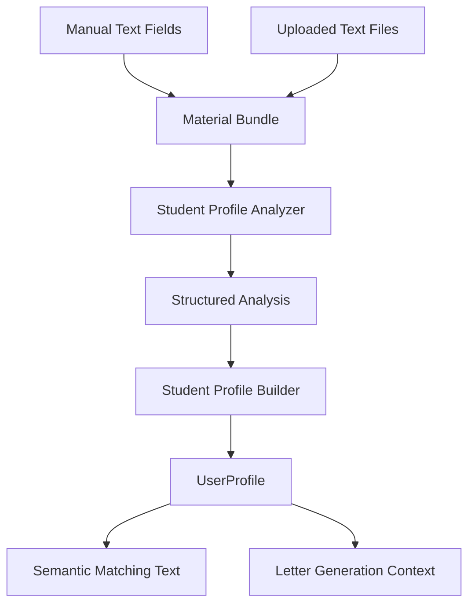

## Context
The current profile flow treats the uploaded file as a resume and extracts `education`, `research_experience`, `projects`, and `skills`. The requested direction is broader: a student profile should describe academic intent and fit using all user-provided materials, not only resume sections.

The reference `colleague-skill` method separates profile creation into intake, evidence analysis, and profile building. This change adapts that pattern to academic matching rather than personality simulation.

## Goals / Non-Goals
- Goals: support multi-material text intake, direct manual text, evidence-aware student academic profiles, and richer downstream matching text.
- Goals: explicitly mark insufficient evidence instead of inventing profile details.
- Goals: keep manual user input higher priority than inferred content when conflicts occur.
- Non-Goals: PDF/DOCX parsing, external web research about the student, automated application advice, or replacing the existing resume parser.

## Decisions
- Decision: introduce a student profile generation pipeline with two LLM stages: analyzer and builder.
- Decision: analyzer output SHALL be structured and evidence oriented, with sections for research interests, academic background, research capabilities, methods and tools, target directions, strengths, gaps, and conflicts.
- Decision: builder output SHALL produce a readable academic profile derived from analyzer output, with concise evidence notes and explicit insufficient-evidence markers.
- Decision: first-stage uploads SHALL accept only `.md`, `.markdown`, `.txt`, `.tex`, and `.latex`, plus direct text fields in the Web UI.
- Decision: multiple uploaded files and manual text SHALL be merged into one profile generation task, preserving per-source metadata.

## Student Profile Shape
The generated student profile should be usable by matching and letter generation without pretending to know unstated facts.

Expected top-level sections:
- Academic positioning: short summary of the student's field, interests, and current level.
- Research interests: normalized topics with supporting evidence from materials.
- Background evidence: education, projects, research, publications, awards, or relevant plans found in the materials.
- Methods and skills: concrete methods, tools, datasets, domains, and languages.
- Target directions: stated or inferred application directions, with inference labels.
- Strengths and gaps: evidence-backed strengths and missing information.
- Source notes: source names and any conflicts between manual text and uploaded files.

## Data Flow

## Risks / Trade-offs
- Multi-material input can exceed LLM context limits. The implementation should reject oversized payloads with a clear error rather than silently truncating important materials.
- Free-form user materials may contain contradictions. The analyzer should surface conflicts and prefer manual text over file-inferred conclusions.
- Storing source snippets improves transparency but may duplicate sensitive user content. The implementation should store source metadata and concise evidence notes, not large repeated extracts beyond the existing raw material storage decision.

## Migration Plan
Existing `UserProfile` records remain valid. New profile fields are nullable or have empty defaults, and matching continues to work for older resume-only profiles.
