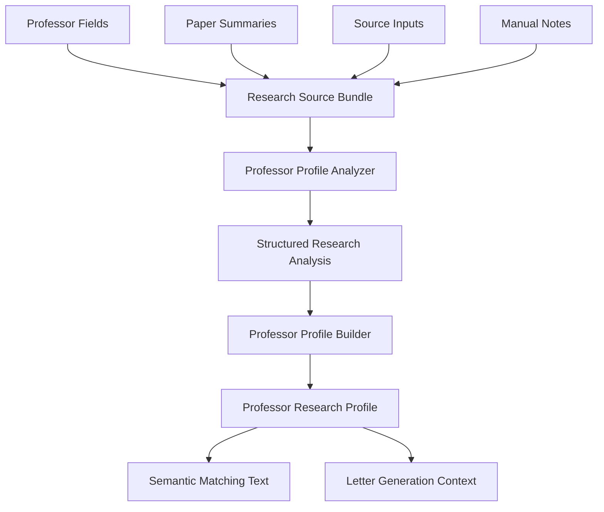

## Context
The professor model already stores `research_interests`, `publications`, `paper_summaries`, `manual_notes`, and optional source inputs. These fields are valuable but fragmented. A generated research profile can turn them into a stable representation for matching, professor review, and personalized contact letters.

This change adapts the reference profile method's analyzer-then-builder pattern to academic research characterization. It does not model a professor's personality; it models the professor's research situation and evidence-backed fit signals.

## Goals / Non-Goals
- Goals: generate accurate professor research profiles from existing professor data and source summaries.
- Goals: expose source evidence, confidence, conflicts, and insufficient-evidence markers.
- Goals: improve matching and letters by giving downstream code a coherent research profile.
- Non-Goals: web-wide scholar research, automatic claim verification beyond available sources, faculty personality modeling, or changing crawler coverage.

## Decisions
- Decision: introduce a professor research profile pipeline with two LLM stages: analyzer and builder.
- Decision: analyzer output SHALL be structured and grounded in the professor's stored fields and source inputs.
- Decision: builder output SHALL produce a concise, readable research profile with evidence notes and explicit gaps.
- Decision: manual notes SHALL be treated as user-supplied context with higher priority than inferred conclusions, while conflicts are recorded.
- Decision: generated research profiles SHALL invalidate or refresh cached professor embeddings because matching text changes.

## Professor Profile Shape
Expected top-level sections:
- Research positioning: a concise statement of the professor's main agenda.
- Research themes: normalized topics and subtopics with source evidence.
- Methods and assets: methods, datasets, systems, instruments, or theoretical tools.
- Representative works: selected publications or summaries with why they matter.
- Recent direction: recent or active work when evidence exists.
- Student fit signals: what student backgrounds appear aligned with the professor's work.
- Evidence and gaps: source notes, confidence levels, conflicts, and missing information.

## Data Flow

## Risks / Trade-offs
- Sparse professor records can produce generic profiles. The builder must mark missing evidence rather than fill gaps.
- Publications may be stale or noisy. The analyzer should separate explicit stored facts from inferred themes.
- Cached embeddings can become stale after profile generation. The implementation should clear or recompute professor embeddings when research profile fields change.

## Migration Plan
Existing professor records remain valid. New research profile fields are nullable or default empty. Professors without generated profiles continue to use `research_interests`, `publications`, `paper_summaries`, affiliation, and manual notes in matching and letters.
